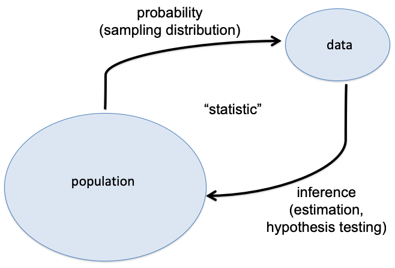

```{r setup, include=FALSE}
knitr::opts_chunk$set(echo = TRUE)
```

```{r}
library(ggplot2)
```

Key ideas:

1. How to use server to do homework
2. Notation
3. Likelihood function: how they are defined, what they look like, $L(\theta)$ notation, proportionality and plotting in R
4. Maximum Likelihood Estimator (MLE) and its functional invariance

### 1. Demonstration of how to use the server, pulling the assignment with the link and making a copy of the .rmd file to do homeworks

### 2. Notations:
#### a) Random Variable and Realization of a Random Variable
- A Random Variable is a variable whose values depend on outcomes of a random event.
  
  + The height of 100 randomly selected human beings. $Y_1, Y_2, \dots, Y_{100}$
      
- Realization of a random variable is the outcome of one random event. 
       
  + We find 100 human beings and measure their heights. $y_1, y_2, \dots, y_{100}$

  
#### b) Population and Sample
- Population is a set of similar items or events which is of interest for some questions or experiments.
  
  + The height of all human beings.
  
- Sample is a set of data collected from a population by a defined method.

  + If we find 100 students in UCSB and measure their heights, then the heights of those 100 students forms a sample of heights of human beings with sample size 100. Of course, this sample is not representative and we need a better sampling method.

- If we want to know what is the mean height of all human beings (Property of the population, we call it parameter), we have to measure the height of each human beings, which is not feasible. Instead, we take a sample, which has much smaller size compared to the number of human beings and use the sample mean to inference about the population mean.

  + Can you suggest some better ways to get a representative sample than measuring the heights of 100 UCSB students?
  
#### c) Estimator and Estimate
- Estimator is a random variable. It gives a rule to estimate the parameter from a sample.

  + We randomly select 10,000 human beings and the mean height is the estimator of mean height of all human beings. $$\bar{Y}=\sum_{i=1}^{10,000} Y_i  /n$$

- Estimates is the corresponding realization of the estimator.

  + Say we have already selected 10,000 human beings and measured their heights ($y_1, y_2, \dots, y_{10,000}$). Then the estimate is $$\bar{y}=\sum_{i=1}^{10,000} y_i  /n$$

```{r echo = FALSE, message=FALSE, out.width = "60%"}



```

### 3. Likelihood and Log-likelihood

#### a) Let $X_1, X_2,\dots, X_n \sim N(\mu,1)$. The dataset obtained is $x_1,x_2,\dots,x_n$. Find the likelihood, log-likelihood and proportional simplification. What is the MLE?

\hfill\break
\hfill\break
\hfill\break
\hfill\break
\hfill\break
\hfill\break
\hfill\break
\hfill\break
\hfill\break
\hfill\break
\hfill\break
\hfill\break
\hfill\break
\hfill\break
\hfill\break
\hfill\break


#### b) Let's assume $n=100$ and we get our dataset from the follow codes. Plot the log-likelihood function.
```{r}
set.seed(123)
n <- 100
x <- rnorm(100, mean = 0, sd=1)
```

```{r}
L1 <- function(mu){#Log-Likelihood Function with normalizing constants 
  -(n/2)*log(2*pi)-n*(mean(x)-mu)^2
}
p1 <- ggplot(data = data.frame(mu = 0), mapping = aes(x=mu))+stat_function(fun = L1)+
     xlim(-5,5)+scale_y_continuous(name = "Likelihood")
p1 #plot log-likelihood function against mu
p1+geom_vline(xintercept = mean(x), color = 'red') #identify the MLE

L2 <- function(mu){#Log-Likelihood Function without normalizing constants 
  -n/2*(mean(x)-mu)^2
}
p2 <- ggplot(data = data.frame(mu = 0), mapping = aes(x=mu))+stat_function(fun = L2)+
     xlim(-5,5)+scale_y_continuous(name = "Likelihood")
p2 #plot log-likelihood function against mu
p2+geom_vline(xintercept = mean(x), color = 'red') #identify the MLE
```

### c) Let $X_1, X_2,\dots, X_n \sim Bernoulli(p)$. The dataset obtained is $x_1,x_2,\dots,x_n$. Find the likelihood, log-likelihood, proportional simplification and MLE. Then plot the log-likelihood function with respect to p assuming we have the following data:
```{r}
set.seed(123)
n <- 100
x <- rbinom(n, 1, 0.5)
```

\hfill\break
\hfill\break
\hfill\break
\hfill\break
\hfill\break
\hfill\break
\hfill\break
\hfill\break
\hfill\break
\hfill\break\hfill\break
\hfill\break
\hfill\break
\hfill\break

```{r}
L <- function(p){#Log-Likelihood Function
  sum(x)*log(p)+(n-sum(x))*log(1-p)
}
p <- ggplot(data = data.frame(p = 0), mapping = aes(x=p))+stat_function(fun = L)+
     xlim(0,1)+scale_y_continuous(name = "Likelihood")
p #plot log-likelihood function against mu
p+geom_vline(xintercept = mean(x), color = 'red') #identify the MLE
```


### 4. Let $X_1, X_2,\dots, X_n \sim N(\mu,\sigma^2)$. The dataset obtained is $x_1,x_2,\dots,x_n$.
#### a) Find the MLE of $\mu$, $\sigma^2$.

\hfill\break
\hfill\break
\hfill\break
\hfill\break
\hfill\break
\hfill\break
\hfill\break
\hfill\break
\hfill\break
\hfill\break
\hfill\break
\hfill\break
\hfill\break
\hfill\break
\hfill\break
\hfill\break
\hfill\break

#### b) Find the MLE of $\mu^3$


