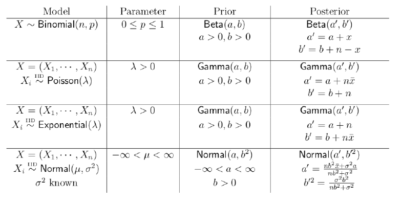
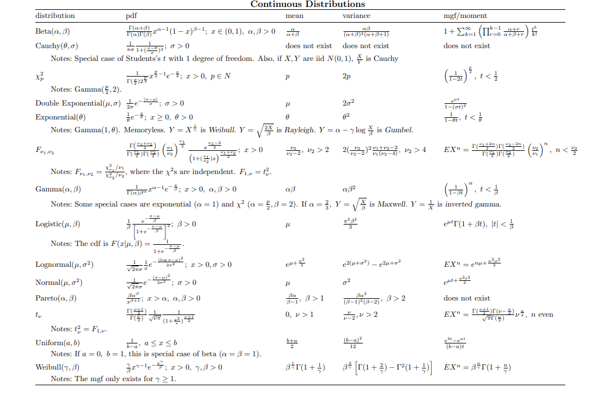

  
```{r setup, include=FALSE}
library(knitr)
knitr::opts_chunk$set(echo=TRUE, 
                      cache=FALSE, 
                      fig.width=5, 
                      fig.height=5,
                      fig.align='center')
library(tidyverse)
library(ggplot2)
```

# This lab will focus on the followng topics:

* Derive posterior distribution from prior and likelihood function

* Common conjugate priors and the meaning of them.

* Posterior mean and MAP estimates


The following example will be adopted throughout to illustrate the concepts.

# Estimating the probability of a female birth
  The proportion of births that are female has long been a topic of interest both scientifically and to the lay public. Two hundred years ago it was established that the proportion of female births in European populations was less than 0.5. The currently accepted value of the proportion of female births in large European-race populations is 0.485. 
  
* Assuming Bernoulli distribution for each child birth, and let $p$ denote the probability of being a female. What is the probability of observing $y$ female babies among $n$ newborn babies (y is between 0 and n, inclusive)? 

*Solution*: It is the binomial density
$${n \choose y}p^{y}(1-p)^{n-y}$$

* Now assume we do not have any prior information about the probability of female birth, so a uniform prior on $[0,1]$ is used. What is the posterior distribution under this prior?

*Solution*:
\begin{align*}
p(\theta | y ) &\propto p(\theta) * p(y | \theta)\\
& =  {n \choose y}p^{y}(1-p)^{n-y} \text{ (in this context $\theta$ is $p$)}\\
&\propto p^{y}(1-p)^{n-y}\\
\end{align*}
The above corresponds to the functional form of a beta distribution. Specifically, it is $Beta(y + 1, n - y + 1)$.


* We know the uniform distribution is a special case of the Beta distribution. Now what if we apply a $Beta(2, 2)$ distribution as our prior? What is the posterior distribution now? 

*Solution*:
\begin{align*}
p(\theta | y ) &\propto p(\theta) * p(y | \theta)\\
& =  p^{2-1} * (1-p)^{2-1}{n \choose y}p^{y}(1-p)^{n-y} \text{ (in this context $\theta$ is $p$)}\\
&\propto p^{y+1}(1-p)^{1+n-y}\\
\end{align*}
The above corresponds to the functional form of a beta distribution. Specifically, it is $Beta(y + 2, n - y + 2)$.


# Common Conjugate priors

Conjugacy is formally defined as follows. A collection of pdfs (or pmfs) is called a conjugate prior family for a model $X \sim f(x|\theta), \theta \in \Theta$, if whenever a prior $\xi(\theta)$ is chosen from the collection, it leads to a posterior $\xi(\theta|x)$ that is also a member of the collection, for every observation $X = x$. For instance, in our above binomial model, the Beta distribution is a conjugate prior to the binomial distribution.
\newline 

Conjugate priors permit fast posterior computations, which can be valuable in high dimension problems. Meanwhile, there are handy formulas for mean and mode of the posterior distributions. The following table summarizes the common distribution we might encounter throughout the course. The mean and variance of each posterior distribution are also of importance.
```{r, echo=FALSE,  out.width = "400px"}
library(png)


```

*Solution*: There is no problem for this part. But you are encouraged to derive the conjugate pairs listed in the table to appreciate this beautiful idea.


# Posterior mean and MAP estimates

An early study concerning the sex of newborn Germany babies found that of a total of 98 births, 43 were female. Assume we are using the uniform prior.

* Plotting the prior distribution (in blue lines), binomial likelihood (in green lines) and the posterior distribution (in red lines). 
```{r}
# prior 
curve(p/p, from = 0, to = 1, xname = "p", xlab = "p", ylab = "density",  
      ylim = c(0, 8), col = 'blue')

# likelihood
curve(choose(98, 43) * p^43 * (1-p)^(98-43), 
      from = 0, to = 1,  xname = "p", 
      xlab = "p", ylab = "likelihood", add = TRUE,  ylim = c(0, 8), col = 'green')

# posterior
a_post = 1 + 43
b_post = 1 + 98 - 43
curve(gamma(a_post + b_post)/gamma(a_post)/gamma(b_post) *
      p^(a_post - 1) * (1-p)^(b_post - 1), from = 0, to = 1, xname = "p", 
      xlab = "p", ylab = "density", add = TRUE, ylim = c(0, 8), col = 'red')
```
It helps to plot the likelihood alone.

```{r}
# likelihood
curve(choose(98, 43) * p^43 * (1-p)^(98-43), 
      from = 0, to = 1,  xname = "p", 
      xlab = "p", ylab = "likelihood", col = 'green')
```

The posterior probability distribution contains all the current information about the parameter $\theta$. A graphical report on the entire posterior distribution is definitely meaningful and useful. For many practical cases, however, various numerical summaries of the distributions are desirable. 

* As for all distributions, the mean of the distribution is an important location summary. What is the mean of the posterior distribution of our above example?

*Solution*:
 Following the above formula, we can see the posterior is a $Beta(44, 56)$ distribution. Therefore by the formula of Beta distribution we know the mean is $\frac{44}{(44 + 56)} = 0.44.$

* Meanwhile, the MAP (maximum a posteriori), which is the mode of the posterior distribution, can be interpreted as the single "most likely" value of the parameter, given the data and the model. What is the MAP estimate in our posterior distribution?

*Solution*:
 Consider the density of the posterior distribution, which is 
$$\frac{\Gamma(44 + 56)}{\Gamma{(44)} \Gamma{(56)}}p^{44-1}(1-p)^{56-1}.$$
Since the $MAP$ is the mode of the posterior distribution, it is the $MLE$ of p. To maximize the above density, it is equivalent to maximizing the log-likelihood after simplification, which is 
$$43\log(p) + 55\log(1-p).$$
By taking the derivative with respect to $p$ and setting it to 0, we get the $MAP$ of $p$ is $\frac{43}{98}$.\newline\newline
Alternatively, you can check the formula for the mode of the Beta distribution directly.

* Is there always a unique MAP value in the posterior distribution? 

*Solution*:
 No. The posterior distribution might be bimodal or multimodal, therefore we might encounter multiple MAPs.


